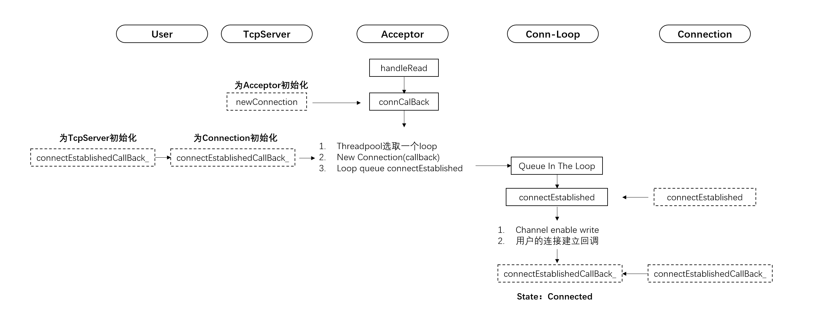
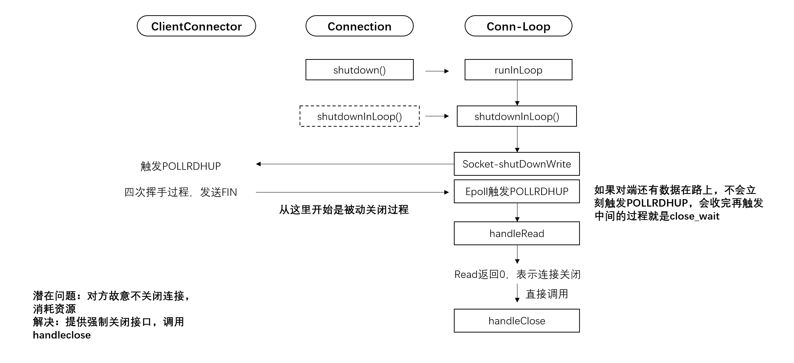
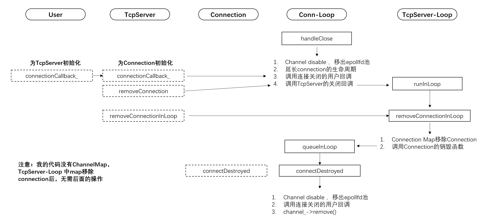

# TcpServer笔记  
## Connection建立  

建立的过程比较简单，handle读到accept的可读事件，在handleRead里以非阻塞的形式配合ET模式尽可能多收socket，然后创建connection找线程池分配一个loop，最后在loop的queue队列中执行连接成功的回调
 
___
## Connection关闭  

关闭过程可分为主动和被动两种  
1. 主动关闭  
  服务端调用shutDown()，socket关闭己方的写连接，内核发送fin，此时客户端可能还有数据未发完，继续发送数据，发完后发送fin，进入lastACK；也可能捎带机制直接发送fin。服务端收到后触发POLLRDHUP，读0，调handleClose进入析构阶段
2. 被动关闭  
  客户端关闭自己的写端，服务端收到后触发POLLRDHUP，读0，调handleClose进入析构阶段  

潜在问题：  
* 客户端不关闭连接造成资源浪费
* 解决：提供强制关闭的接口，利用定时机制断开长时间连接的connection
 
___
## Connection析构  

重点：生命周期保护  
1. 在handleRead里不可以对Connection和Channel有任何析构的可能，在函数执行中对实体进行析构会造成严重后果  
   方法：
   1. channel的WeakPtr提升以延长Connection生命周期，保证回调函数不会在析构Connection
   2. 在TcpServer线程中对Connection完成最终析构，保证不会和Connection的工作线程产生任何冲突

 
