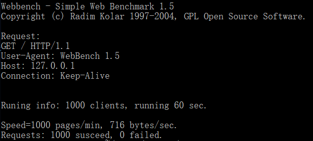

## 压力测试
___
* 压力测试工具：WebBench 1.5  
* 测试环境：
  * wsl+ubuntu:18.04  
  * AMD Ryzen 5 4600H 3.0GHz  
  * 本地网络
* 测试结果
  * QPS：最高1.6w
1. 1000client 短连接 60s
  
  
2. 5000client 短连接 60s
  
  
3. 10000client 短连接 60s
  
  
4. 1000client 长连接 60s（CPU几乎完全空闲
   

* 尚未解决的问题：
  * 1000client无法跑满cpu，只有在更多client的时候可以跑满，是关闭连接出了问题？
  * webbench在大量请求的情况多运行几次，httpServer崩溃，gdb追踪发现产生writebug，即在write写入socket文件描述符的时候写入失败，找不到write.c，非常困惑
  * 长连接succeed数量与client数量一致，与其他人运行的结果不一致，是关闭连接出了问题？但netstat查询端口发现没有什么问题
* 性能优化思路：
  * Acceptor：目前是accept每次收完所有的socket，这是高效的做法吗，本人认为收N个之后再接收handle执行回调会浪费时间
  * wsl满负荷运行时，windows资源管理器显示cpu完全没跑满，wsl仅用了40%，合理怀疑可能系统锁wsl的资源
  * 其他思路暂时想不到，有了再补充